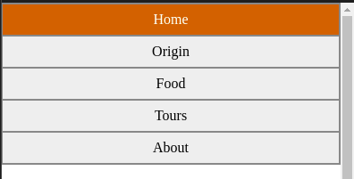
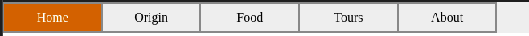

# Report: Quiz 1

```yaml
Name: Muhammad Hidayat
NRP: 05111940000131
Class: D
```

In this report, I will be explaining about the website that I created. I will talk about the design and features of the site. Note that there are no external libraries such as jQuery or Bootstrap used.

## General Design


For this site, I decided to go for orange as the primary color. It is the color that I use as a personal brand logo. As you can see in the image above, the color is predominantly red with a gradient of orange. Therefore, that is theme I am going to follow.

## Navbar

The navigation bar (_navbar_) is a feature on the site that lets a user navigate between pages easily. This is located at the top of the page. The design I go for is relatively simple, but is responsive to the size of the browser. If the size is small (ie. for mobile), the navbar stacks down. Otherwise, the navbar spreads to the right.

This is achieved using media queries. The layout is initially designed for a smaller screen first (as in mobile-first), then there is a breakpoint at 600px where another layout for tablets and PC are used.

```css

/* style for small screen here */

@media only screen and (min-width: 600px) {
    /* style for large screen here */
}
```





## SVG Element Toggling

The logo you see on the top and on the homepage is actually an SVG file/element. For the homepage, the contents of the SVG file is copied over into the HTML file. This is the only way that you can manipulate SVG files in JavaScript.

When you press the button "Switch logo color", the logo will alternate between colored version and white version for dark mode. Also for a twist, there is a probabiity that the background of the logo could be either square or circle.

This is done by switching the CSS property `display` to either `block/inline` or `none`.

## Image Toggling

In the hometown (Origin) page, there is an image of the map. If clicked, the border of the city will be shown. This is actually just two images alternating their `display` property just like before.

## Image Gallery

Perhaps the most complex part of the page. It involves quite an amount of CSS and JS to work. What is basically does is hiding the other image while the current image is selected. Which image to be shown is determined by the previous/next arrows on the image. The description data is coded in JavaScript as well as the mechanism to switch images. CSS is used to position the image, counter, arrows, and caption block.

This is used in both Food and Tours page to display images as well as their respective descriptions. 

## Conclusion

This project is far from perfect, but it is usable and can be viewed in both mobile and desktop on the following link: https://return215.github.io/webprog22-quiz1
